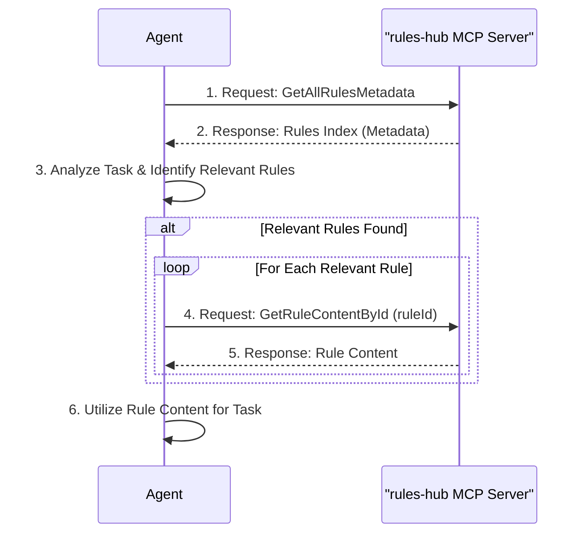

# AgentRulesHub Architecture Overview

## Introduction

The AgentRulesHub is a Model Context Protocol (MCP) server designed to manage and provide contextual rules for AI agents. It allows agents to dynamically retrieve rules based on various criteria such as programming language or specific rule identifiers.

This document provides a comprehensive overview of the AgentRulesHub architecture to facilitate implementation in Go or other languages.

## Table of Contents

1. [Overview and Purpose](#overview-and-purpose)
2. [System Architecture](#system-architecture)
3. [Core Components](#core-components)
4. [Data Models](#data-models)
5. [Workflow and Sequence Diagrams](#workflow-and-sequence-diagrams)
6. [Configuration](#configuration)
7. [API/Tools](#api-tools)
8. [Implementation Considerations for Go](#implementation-considerations-for-go)

## Overview and Purpose

### Key Motivations

- **Centralized Rule Management**: Provides a structured way to organize and access rules across different agents or projects
- **Context Optimization**: Enables agents to retrieve only relevant rules, minimizing context length and improving efficiency
- **Flexible Rule Retrieval**: Supports retrieving rules based on language, ID, or other metadata

### Core Functionality

- Dynamic rule retrieval based on criteria
- YAML-based rule storage
- Configurable rule sources
- MCP integration for AI agent consumption

## System Architecture

The AgentRulesHub follows a modular architecture with clear separation of concerns:

```
┌─────────────────────────────────────────────────────────────┐
│                     AgentRulesHub MCP Server                 │
├─────────────────────────────────────────────────────────────┤
│                                                             │
│  ┌───────────────┐    ┌───────────────┐    ┌──────────────┐ │
│  │ Rule Loaders  │    │ Rule Parsers  │    │ Rule Storage │ │
│  └───────┬───────┘    └───────┬───────┘    └──────┬───────┘ │
│          │                    │                    │         │
│          └────────────┬───────┘                    │         │
│                       │                            │         │
│                       ▼                            │         │
│  ┌───────────────────────────────────────┐        │         │
│  │      Rule Loader Orchestrator         │        │         │
│  └───────────────────┬───────────────────┘        │         │
│                      │                             │         │
│                      ▼                             ▼         │
│  ┌───────────────────────────────────────────────────────┐  │
│  │                Rule Repository                         │  │
│  └───────────────────────────┬───────────────────────────┘  │
│                              │                               │
│                              ▼                               │
│  ┌───────────────────────────────────────────────────────┐  │
│  │                MCP Tools/API Layer                     │  │
│  └───────────────────────────────────────────────────────┘  │
│                                                             │
└─────────────────────────────────────────────────────────────┘
```

### Key Components

1. **Rule Loaders**: Responsible for loading rules from different sources (e.g., YAML files)
2. **Rule Parsers**: Parse rule content from specific formats (e.g., YAML)
3. **Rule Storage**: In-memory repository for storing and retrieving rule metadata
4. **Rule Loader Orchestrator**: Coordinates loading rules from multiple sources
5. **MCP Tools/API Layer**: Exposes functionality to MCP clients

## Task Flow

This section describes the typical flow of an AI agent interacting with the AgentRulesHub MCP server to retrieve and utilize rules for a given task.

1. **Task Initiation**: An agent (e.g., Cline) begins a new task.
2. **Retrieve Rule Index**: The agent queries the `rules-hub` MCP server using the `GetAllRulesMetadata` tool. This provides an index of all available rules, including their IDs, descriptions, languages, and tags.
3. **Identify Relevant Rules**: Based on the current task's context (e.g., programming language, keywords, objectives) and the metadata received, the agent analyzes the rule index to identify which rules are relevant.
4. **Retrieve Rule Content**: If relevant rules are identified, the agent uses the `GetRuleContentById` tool for each relevant rule ID to fetch its specific content.
5. **Utilize Rules**: The agent incorporates the content of the retrieved rules to guide its actions, improve its output, or ensure adherence to specific guidelines for the task at hand.



## Configuration

The system is configured through appsettings.json and environment variables.

### Configuration Structure

```json
{
  "RuleSources": {
    "Sources": [
      {
        "LoaderType": "YamlFile",
        "Settings": {
          "Path": "path/to/rules"
        }
      }
    ]
  }
}
```

### Environment Variable Configuration

Environment variables can override configuration settings:

```
RuleSources:Sources:0:LoaderType=YamlFile
RuleSources:Sources:0:Settings:Path=path/to/rules
```

## API/Tools

The system exposes functionality through MCP tools.

### GetRuleContentById

Retrieves the content of a specific rule by its ID.

**Input**: Rule ID (string)
**Output**: Rule content (string)

### GetAllRulesMetadata

Retrieves metadata for all available rules.

**Input**: None
**Output**: List of rule metadata (AgentRule objects)

## References

- [Component Details](component-details.md)
- [Data Models](data-models.md)
- [Workflow Diagrams](workflow-diagrams.md)
- [Go Implementation Guide](go-implementation-guide.md)
