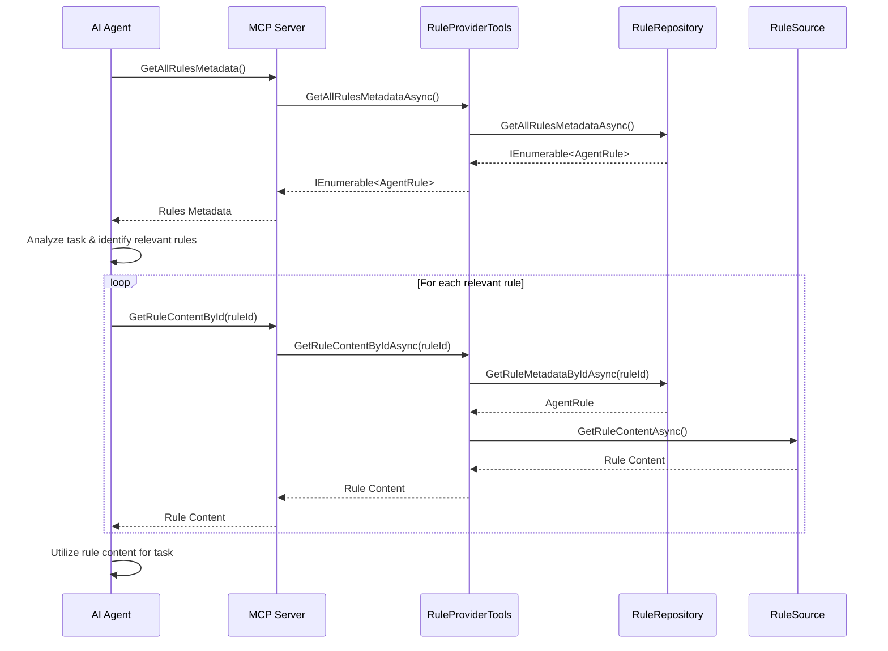

# AgentRulesHub Architecture Summary

This document provides a summary of the AgentRulesHub architecture and serves as an index to the detailed documentation files.

## Overview

AgentRulesHub is a Model Context Protocol (MCP) server designed to manage and provide contextual rules for AI agents. It allows agents to dynamically retrieve rules based on various criteria such as programming language or specific rule identifiers.

The system follows a modular architecture with clear separation of concerns, making it adaptable to different implementation languages and environments.

## Documentation Index

The architecture documentation is organized into the following files:

1. [Architecture Overview](architecture-overview.md) - High-level overview of the system architecture
2. [Component Details](component-details.md) - Detailed information about each component in the system
3. [Data Models](data-models.md) - Specifications for the data models used in the system
4. [Workflow Diagrams](workflow-diagrams.md) - Workflow and sequence diagrams illustrating system behavior
5. [Go Implementation Guide](go-implementation-guide.md) - Guidance for implementing the system in Go

## Key Components

The AgentRulesHub system consists of the following key components:

1. **Rule Loaders**: Responsible for loading rules from different sources (e.g., YAML files)
2. **Rule Parsers**: Parse rule content from specific formats (e.g., YAML)
3. **Rule Storage**: In-memory repository for storing and retrieving rule metadata
4. **Rule Loader Orchestrator**: Coordinates loading rules from multiple sources
5. **MCP Tools/API Layer**: Exposes functionality to MCP clients

## System Architecture Diagram

```
┌─────────────────────────────────────────────────────────────┐
│                     AgentRulesHub MCP Server                 │
├─────────────────────────────────────────────────────────────┤
│                                                             │
│  ┌───────────────┐    ┌───────────────┐    ┌──────────────┐ │
│  │ Rule Loaders  │    │ Rule Parsers  │    │ Rule Storage │ │
│  └───────┬───────┘    └───────┬───────┘    └──────┬───────┘ │
│          │                    │                    │         │
│          └────────────┬───────┘                    │         │
│                       │                            │         │
│                       ▼                            │         │
│  ┌───────────────────────────────────────┐        │         │
│  │      Rule Loader Orchestrator         │        │         │
│  └───────────────────┬───────────────────┘        │         │
│                      │                             │         │
│                      ▼                             ▼         │
│  ┌───────────────────────────────────────────────────────┐  │
│  │                Rule Repository                         │  │
│  └───────────────────────────┬───────────────────────────┘  │
│                              │                               │
│                              ▼                               │
│  ┌───────────────────────────────────────────────────────┐  │
│  │                MCP Tools/API Layer                     │  │
│  └───────────────────────────────────────────────────────┘  │
│                                                             │
└─────────────────────────────────────────────────────────────┘
```

## Core Interfaces

The system is built around the following core interfaces:

1. **IRuleLoader**: Interface for loading rules from different sources
2. **IRuleParser**: Interface for parsing rule content from specific formats
3. **IRuleRepository**: Interface for storing and retrieving rule metadata
4. **IRuleLoaderOrchestrator**: Interface for coordinating rule loading from multiple sources
5. **RuleSource**: Abstract base class for different rule sources

## Data Flow

The following diagram illustrates how data flows through the system:

```
┌─────────────┐     ┌─────────────┐     ┌─────────────┐
│ YAML File   │────►│ YamlContent │────►│ AgentRule   │
└─────────────┘     └─────────────┘     └──────┬──────┘
                                               │
                                               ▼
┌─────────────┐     ┌─────────────┐     ┌─────────────┐
│ Rule        │◄────┤ Rule        │◄────┤ Repository  │
│ Content     │     │ Source      │     │             │
└─────────────┘     └─────────────┘     └─────────────┘
```

## MCP Client Interaction

The following sequence diagram illustrates the interaction between an AI agent and the AgentRulesHub MCP server:



## Implementation Considerations for Go

When implementing this system in Go, consider the following:

1. **Interfaces**: Define interfaces for all components to enable easy testing and mocking
2. **Error Handling**: Return errors explicitly from functions instead of using exceptions
3. **Concurrency**: Use goroutines and channels for parallel rule loading
4. **Configuration**: Use a library like Viper for configuration management
5. **YAML Parsing**: Use gopkg.in/yaml.v3 for YAML parsing
6. **HTTP Server**: Use the standard net/http package or a framework like Gin or Echo
7. **Dependency Management**: Use Go modules for dependency management

For detailed Go implementation guidance, refer to the [Go Implementation Guide](go-implementation-guide.md).

## Configuration

The system is configured through appsettings.json and environment variables:

```json
{
  "RuleSources": {
    "Sources": [
      {
        "LoaderType": "YamlFile",
        "Settings": {
          "Path": "path/to/rules"
        }
      }
    ]
  }
}
```

## MCP Tools

The system exposes the following MCP tools:

1. **GetRuleContentById**: Retrieves the content of a specific rule by its ID
2. **GetAllRulesMetadata**: Retrieves metadata for all available rules

## Rule File Format

Rules are defined in YAML files with the following structure:

```yaml
id: sample001
description: A sample rule for testing purposes.
language: csharp
tags:
  - example
  - test
rule: |
  // This is a sample C# rule content.
  public class SampleRuleClass
  {
      public void Execute()
      {
          Console.WriteLine("Sample rule executed!");
      }
  }
```

## Conclusion

The AgentRulesHub architecture provides a flexible and extensible system for managing and providing contextual rules for AI agents. The modular design allows for easy adaptation to different implementation languages and environments, while the MCP integration enables seamless interaction with AI agents.

For detailed information about specific aspects of the architecture, refer to the documentation files listed in the [Documentation Index](#documentation-index).
