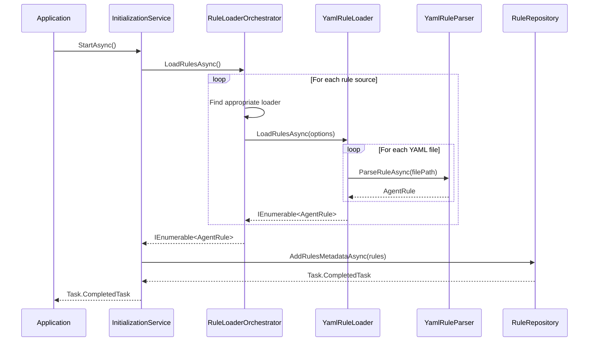
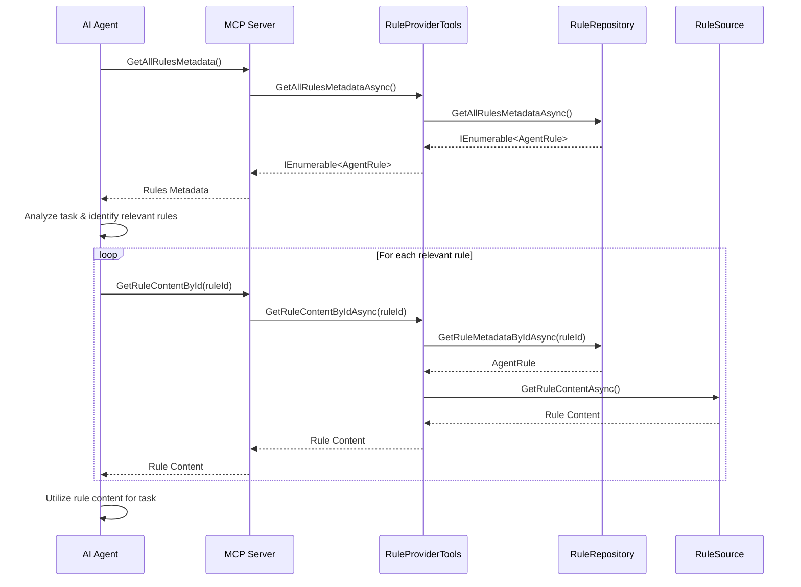
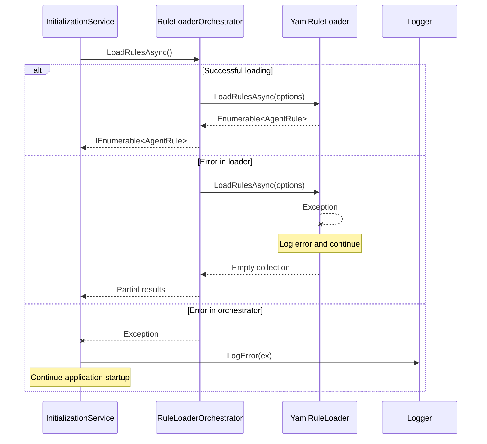
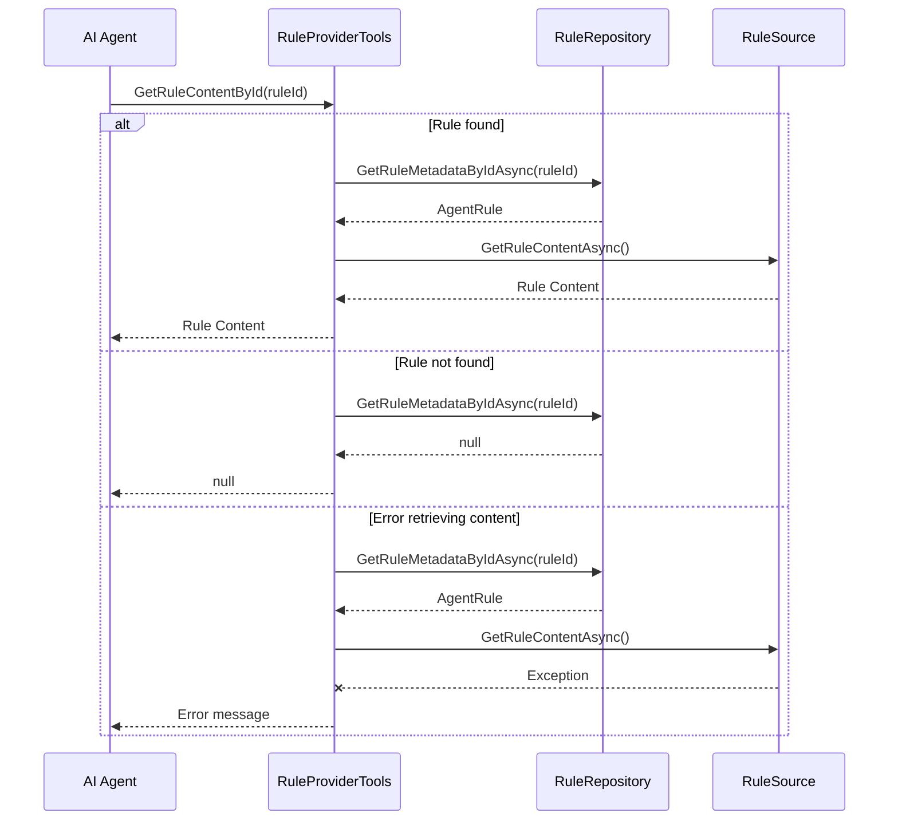

# AgentRulesHub Workflow Diagrams

This document provides detailed workflow and sequence diagrams for the AgentRulesHub system.

## Table of Contents

1. [Application Startup Flow](#application-startup-flow)
2. [Rule Loading Sequence](#rule-loading-sequence)
3. [Rule Retrieval Flow](#rule-retrieval-flow)
4. [MCP Client Interaction](#mcp-client-interaction)
5. [Error Handling Flows](#error-handling-flows)

## Application Startup Flow

The following diagram illustrates the application startup process:

```
┌─────────────┐      ┌────────────────────┐      ┌─────────────────────┐      ┌───────────────────┐
│ Application │      │ Initialization     │      │ Rule Loader         │      │ Rule Repository   │
│ Startup     │──────► Service            │──────► Orchestrator        │──────► (In-Memory)       │
└─────────────┘      └────────────────────┘      └─────────────────────┘      └───────────────────┘
                                │                           │                            │
                                │                           ▼                            │
                                │                 ┌─────────────────────┐                │
                                │                 │ Rule Loaders        │                │
                                │                 │ (YamlRuleLoader)    │                │
                                │                 └──────────┬──────────┘                │
                                │                           │                            │
                                │                           ▼                            │
                                │                 ┌─────────────────────┐                │
                                │                 │ Rule Parser         │                │
                                │                 │ (YamlRuleParser)    │                │
                                │                 └──────────┬──────────┘                │
                                │                           │                            │
                                │                           │                            │
                                └───────────────────────────┴────────────────────────────▶
```

### Detailed Sequence

1. **Application Startup**:
   - The application starts and configures services
   - Dependency injection container is set up
   - Configuration is loaded from appsettings.json and environment variables

2. **Initialization Service**:
   - Implements IHostedService
   - StartAsync method is called during application startup
   - Calls the Rule Loader Orchestrator to load rules

3. **Rule Loader Orchestrator**:
   - Iterates through configured rule sources
   - For each source, finds the appropriate loader
   - Calls the loader to load rules from the source

4. **Rule Loaders**:
   - YamlRuleLoader loads rules from YAML files
   - Uses the Rule Parser to parse each file
   - Returns a collection of AgentRule objects

5. **Rule Parser**:
   - Parses rule content from files
   - Converts parsed content to AgentRule objects
   - Sets up the rule source for content retrieval

6. **Rule Repository**:
   - Stores rule metadata in memory
   - Provides methods to retrieve rules by ID or get all rules

## Rule Loading Sequence

The following sequence diagram illustrates the rule loading process in more detail:



### Detailed Steps

1. **Application calls InitializationService.StartAsync()**:
   - This happens during application startup
   - The initialization service is responsible for loading rules

2. **InitializationService calls RuleLoaderOrchestrator.LoadRulesAsync()**:
   - The orchestrator is responsible for coordinating rule loading from multiple sources

3. **For each rule source**:
   - The orchestrator finds the appropriate loader for the source type
   - The orchestrator calls the loader's LoadRulesAsync method with the source options

4. **For each YAML file**:
   - The loader calls the parser's ParseRuleAsync method with the file path
   - The parser reads the file, deserializes the YAML, and returns an AgentRule object
   - The loader collects all AgentRule objects into a collection

5. **The loader returns the collection of AgentRule objects to the orchestrator**:
   - The orchestrator combines rules from all sources into a single collection

6. **The orchestrator returns the combined collection to the initialization service**:
   - The initialization service adds the rules to the repository

7. **The initialization service completes its startup task**:
   - The application is now ready to serve rule requests

## Rule Retrieval Flow

The following diagram illustrates the rule retrieval process:

```
┌─────────────┐      ┌────────────────────┐      ┌─────────────────────┐
│ MCP Client  │      │ MCP Tools          │      │ Rule Repository     │
│ (AI Agent)  │──────► (RuleProviderTools)│──────► (In-Memory)         │
└─────────────┘      └────────────────────┘      └──────────┬──────────┘
                                                            │
                                                            ▼
                                                 ┌─────────────────────┐
                                                 │ Rule Source         │
                                                 │ (FileSource)        │
                                                 └─────────────────────┘
```

### Detailed Sequence

1. **MCP Client (AI Agent)**:
   - Calls the GetAllRulesMetadata or GetRuleContentById MCP tool
   - Provides necessary parameters (e.g., rule ID)

2. **MCP Tools (RuleProviderTools)**:
   - Handles the MCP tool request
   - Calls the appropriate method on the Rule Repository

3. **Rule Repository**:
   - For GetAllRulesMetadata, returns all rule metadata
   - For GetRuleContentById, retrieves the rule by ID

4. **Rule Source**:
   - For GetRuleContentById, the rule source is used to retrieve the rule content
   - FileSource reads the rule content from the file

## MCP Client Interaction

The following sequence diagram illustrates the interaction between an AI agent and the AgentRulesHub MCP server:



### Detailed Steps

1. **AI Agent requests all rule metadata**:
   - The agent calls the GetAllRulesMetadata MCP tool
   - The MCP server routes the request to the RuleProviderTools
   - RuleProviderTools calls the repository's GetAllRulesMetadataAsync method
   - The repository returns all rule metadata
   - The metadata is returned to the agent

2. **AI Agent analyzes the task and identifies relevant rules**:
   - The agent examines the task requirements
   - The agent compares the task to the rule metadata
   - The agent identifies rules that are relevant to the task

3. **For each relevant rule, AI Agent requests rule content**:
   - The agent calls the GetRuleContentById MCP tool with the rule ID
   - The MCP server routes the request to the RuleProviderTools
   - RuleProviderTools calls the repository's GetRuleMetadataByIdAsync method
   - The repository returns the rule metadata
   - RuleProviderTools calls the rule source's GetRuleContentAsync method
   - The rule source returns the rule content
   - The content is returned to the agent

4. **AI Agent utilizes the rule content for the task**:
   - The agent incorporates the rule content into its task processing
   - The agent ensures its output adheres to the rules

## Error Handling Flows

The system includes several error handling flows to ensure robustness.

### Rule Loading Error Handling



### Rule Retrieval Error Handling



### Key Error Handling Strategies

1. **Graceful Degradation**:
   - If a rule source fails, the system continues with other sources
   - If a rule file fails to parse, the system continues with other files
   - If rule content cannot be retrieved, the system returns null or an error message

2. **Logging**:
   - Errors are logged with appropriate severity levels
   - Log messages include relevant context information

3. **Exception Handling**:
   - Exceptions are caught at appropriate levels
   - Exceptions are not allowed to propagate to the client unless necessary

4. **Validation**:
   - Input parameters are validated before use
   - Rule data is validated before storage
   - Configuration is validated at startup
